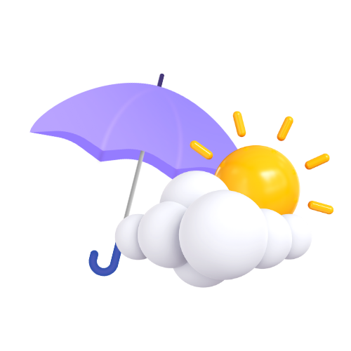

  

# 🌦️ JWX - Josh Weather Experience

**JWX** is a modern and minimal weather web app that lets users check real-time weather conditions and forecasts for any city. Designed for simplicity and clarity, JWX gives users the weather information they need at a glance.

## 🚀 Features

- 🌍 **Search City**: Get current weather data by entering any city name
- 💧 **Humidity**: Displays current humidity levels
- 🌬️ **Wind**: Shows wind speed
- 🌧️ **Precipitation**: Displays rainfall data
- 👀 **Visibility**: Provides visibility range in kilometers
- 📅 **5-Day Forecast**: Shows upcoming daily weather overview

## 🛠️ Built With

- React JS
- Tailwind CSS  
- OpenWeatherMap API

## 🌐 Live Demo

[Visit JWX](https://jwx-swart.vercel.app/)

## 📸 Preview

